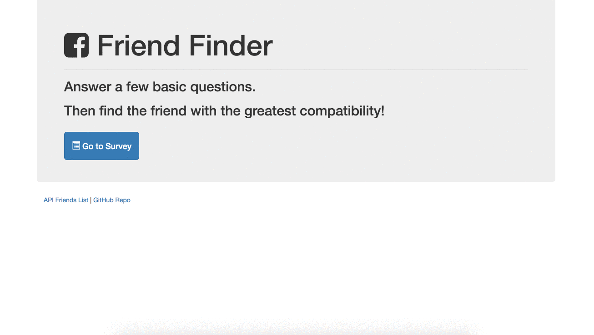

# Friend Finder - Node and Express Servers
### Overview
[Find My Repository](https://github.com/iggy788/FriendFinder "Mike's Repository")

I have built a compatibility-based "FriendFinder" application. This full-stack site will take in results from a survey you will take, then compare their answers with those from other users. The app will then display the name and picture of the user with the best overall match.

The app is deployed on Heroku so whoever may want to fill it out can do as well.
[Go To The Site](https://cryptic-waters-18097.herokuapp.com/ "FriendFind Heroku")

### Instructions

1. The contained survey has 10 questions and each answer should be on a scale of 1 to 5 based on how much the user agrees or disagrees with a question.

2. After you complete the survey I have included a way to handle incoming survey results and the compatibility logic.

3. Once we've found the current user's most compatible friend, display the result as a modal pop-up.
   * The modal displays both the name and picture of the closest match.
- - -
### How the App Should Work!

- - -
### One More Thing

**Install These Packages**
1. npm install express --save
   * [Express](https://www.npmjs.com/package/express)
2. npm install nodemon --save
   * [Nodemon](https://www.npmjs.com/package/nodemon)
3. npm install mysql --save
   * [MySQL](https://www.npmjs.com/package/mysql)
4. npm install body-parser --save
   * [Body Parser](https://www.npmjs.com/package/body-parser)